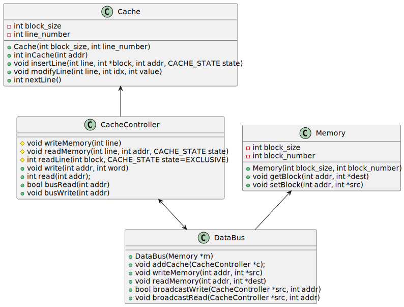

# mesi-sim
A multiprocessor cache simulator in C++, implementing the MESI protocol for cache coherency. Implemented as an assignment for the subject "Arquitetura e Organização de Computadores II".

